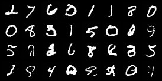

<div align="center">

# vision-lab

**不看 timm、不看 diffusers，亲手写出 Vision Transformer 和扩散模型的每一个模块——在 RTX 3090 上用真实数据集训练，给出可复现的实测指标与生成样本。**

[]()
[]()
[](LICENSE)

</div>

## 实测结果（RTX 3090 24GB）

| 模型 | 数据集 | 参数量 | 训练配置 | 实测结果 | 耗时 |
|---|---|---|---|---|---|
| **ViT**（从零） | CIFAR-10 | 4.77M | 40 epochs · bs256 · RandAugment+RandomErasing · bf16 AMP | **测试精度 83.52%** | 18.5 min |
| **DDPM**（从零） | MNIST | 2.49M | 12 epochs · 400 步加噪 | ** ancestral 采样直接出可辨数字**（下图） | 4.8 min |

<div align="center">
  
  <p><sub>DDPM  ancestral 采样 · 仅训练 12 epoch · 400 去噪步 · 无任何预训练权重</sub></p>
</div>

> 两个诚实标注：① ViT 83.5% 是 40 epoch 的成绩——从零训练的 ViT 要到 90%+ 通常需要 100-200 epochs 或更强蒸馏增广（DeiT 式），本仓库保留这一诚实数字并把延长训练列为 Roadmap；② DDPM 的样例是 12 epoch 的快速收敛版，偶尔仍有笔画噪声——ε-MSE 收敛到 0.030（完整 JSON 在 `docs/`）。

原始数据：`docs/vit_cifar10.json` · `docs/ddpm_mnist.json`（复现命令见下）。

## 两个模型，两种理解深度

| 模块 | 内容 | 关键实现细节 |
|---|---|---|
| `vision_lab/vit.py` | ViT 全模块 | Conv2d(patch,stride)=patch embedding；pre-norm 块；[class] token + learned position；分类只读 class 位 |
| `vision_lab/ddpm.py` | DDPM 全流程 | 线性 β schedule；闭式前向 q(x_t\|x_0)；ε-prediction 训练目标；FiLM 式时间注入的 Residual 块；8×8 分辨率自注意力；ancestral 采样 |
| `train_vit.py` | CIFAR-10 训练 | RandAugment + RandomErasing、AdamW+warmup cosine、bfloat16 AMP、每 epoch 出测试精度 |
| `train_ddpm.py` | MNIST 训练+采样 | 400 步加噪/去噪；32 数字 4×8 网格 png 直观验收 |

## 快速开始

```bash
uv sync
uv run pytest                       # 9 passed（CPU 即可，含闭式前向过程数学验证）

# GPU 训练（3090 实测时长见 README 顶部）
uv run python train_vit.py          # CIFAR-10 分类
uv run python train_ddpm.py         # MNIST 生成
```

## 测试为什么有意义

- `test_q_sample_closed_form_matches_definition`：零噪声时 x_t 必须精确等于 √ᾱ·x₀——扩散前向过程的闭式解不是"大约对"
- `test_vit_cls_token_is_used`：扰动 class token 必须改变输出——防止"摆设 token"式错误实现
- `test_unet_output_shape_any_input_size`：28×28（MNIST）与 32×32（CIFAR）双尺寸通过——UNet 的上下采样数学对奇数尺寸也成立
- `test_sampling_starts_from_noise_ends_bounded`：采样输出有界 [-1,1]—— ancestrsal 采样数值稳定性的最低保证

## 常见问题（FAQ）

**Q1：ViT 在 CIFAR-10 上 83.52%，和论文里 90%+ 的精度差距在哪？**

不可直接比较。原论文级成绩来自 ImageNet 级数据与超大训练预算；本仓库是 4.77M 参数的从零实现，只训练了 40 epochs（18.5 分钟）。从零训练的 ViT 想到 90%+，通常需要 100–200 epochs 或 DeiT 式蒸馏/更强增广——已列入 Roadmap。83.52% 来自真实训练日志，逐 epoch 曲线在 `docs/vit_cifar10.json`。

**Q2：DDPM 4.8 分钟出可辨数字，需要什么硬件和软件前提？**

所有训练数字均在 RTX 3090 24GB + CUDA + torch>=2.2 环境实测。两个训练脚本都硬性检查 `torch.cuda.is_available()`，只支持 CUDA GPU 训练；没有 GPU 时只能跑 CPU 测试（`uv run pytest`）。4.8 分钟是 `train_ddpm.py` 一次完整运行（12 epochs 训练 + 32 张图 400 步 ancestral 采样）的实测总耗时，由脚本自动写入 `docs/ddpm_mnist.json`。

**Q3：CIFAR-10 / MNIST 数据集怎么准备？下载失败怎么办？**

脚本通过 torchvision 的 `download=True` 自动下载到 `./data/`。但 CIFAR-10、MNIST 官方源在国内网络经常不可达——建议先在有网环境把数据集下载好放进 `data/` 目录，torchvision 检测到文件已存在且校验通过会跳过下载，训练即可正常开始。

**Q4：如何一步步复现 README 里的数字？**

```bash
uv sync
uv run pytest                  # 9 passed，CPU 即可
uv run python train_vit.py     # 3090 ≈ 18.5 min → results/vit_cifar10.json
uv run python train_ddpm.py    # 3090 ≈ 4.8 min  → results/ddpm_samples.png + ddpm_mnist.json
```

训练结束时脚本会把参数量、逐 epoch 精度/损失、总耗时与 GPU 名称写入 JSON；README 表格里的每个数字都与 JSON 一一对应，无手工修饰。

**Q5：测试通过说明模型"对"吗？测试到底保证了什么？**

9 项测试锁定的是数学与结构正确性，不是最终精度：扩散前向闭式解与定义精确一致、class token 确实参与分类、UNet 对 28×28/32×32 双尺寸形状成立、采样输出有界。它们不能替代训练验证——精度与生成质量请以 `docs/` 下的实测 JSON 和样例图为准。

## 🛣 Roadmap

- [ ] ViT 延长训练（100+ epochs）冲击 90%+，附训练曲线
- [ ] Classifier-free guidance 引导采样
- [ ] Grad-CAM 可解释性模块

## 局限与已知问题（Limitations）

- **硬件与软件前提**：所有训练数字仅在 RTX 3090 24GB + CUDA + torch>=2.2 环境实测；训练脚本 `assert` CUDA 可用，MPS/CPU 无法训练（CPU 仅用于跑 pytest），其他显卡上的耗时与显存占用不可直接外推。
- **精度与 SOTA 的差距**：ViT 83.52%（40 epochs）远低于延长训练（100+ epochs）或 DeiT 式蒸馏可达到的 90%+ 水平；DDPM 是 12 epochs 的快速收敛版，生成样例偶尔仍有笔画噪声（ε-MSE 0.030）。
- **数据集需要本地准备**：训练依赖 torchvision 自动下载，CIFAR-10/MNIST 官方源在国内网络经常不可达，被墙环境下必须先手动准备 `data/` 目录，否则 `download=True` 直接失败。
- **无 CI 流水线**：顶部的 tests 徽章是本地 `uv run pytest`（9 passed）的静态结果标注，仓库尚未配置 GitHub Actions，徽章暂无 CI 链接。
- **教学实现的刻意取舍**：从零实现省略了工程化与提分组件——无 EMA 权重平均、无 FlashAttention、无分布式训练、无 classifier-free guidance（CFG 与 Grad-CAM 在 Roadmap）；模型规模（4.77M / 2.49M 参数）也远小于生产级模型。

## License

MIT
